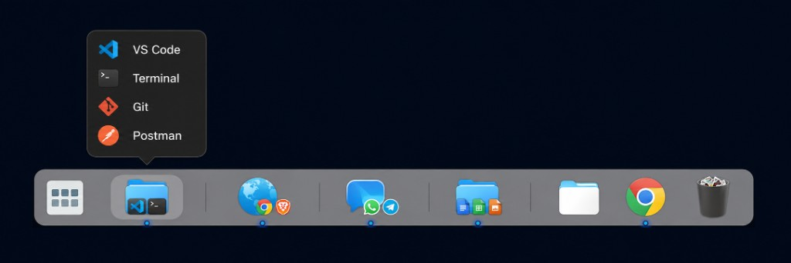

# Application groups for Plank Reloaded

[English](README.md) · [Español](README.es.md) · [Português](README.pt.md) · [Português (Brasil)](README.pt_BR.md)

This docklet adds a launcher folder to the dock. Each instance is a category,
for example Development, Web or Communication. Click the icon to see the
applications in that folder.



Menus, dialogs and the installer follow the system language: English, Spanish
or Portuguese.

## Easy install

On Debian, Ubuntu, Linux Mint and derivatives:

1. Open this folder.
2. Double-click **Install Plank groups**.
3. Accept and enter your password when asked.

If the icon is crossed out, right-click → **Allow launching**.

From a terminal:

```bash
chmod +x install.sh
./install.sh
```

The assistant installs what is missing, copies the docklet and can create three
sample groups (Development, Web and Communication) from programs you already
have.

To remove it: double-click **Remove Plank groups**, or `./desinstalar.sh`.

## How it is organised

Each group is a folder of copies or symbolic links to `.desktop` files. It
does not move or change your programs.

```text
~/Aplicaciones-dock/
├── Desarrollo/       # code.desktop, org.gnome.Terminal.desktop, …
├── Web/              # brave-browser.desktop, firefox.desktop, …
└── Comunicacion/     # telegramdesktop.desktop, discord.desktop, …
```

Original launchers are usually in:

- `/usr/share/applications/` (system applications)
- `~/.local/share/applications/` (your applications)

You can use symbolic links to avoid copies. Example:

```bash
mkdir -p ~/Aplicaciones-dock/Desarrollo
ln -s /usr/share/applications/code.desktop ~/Aplicaciones-dock/Desarrollo/
```

## Build and install by hand

If you prefer not to use the assistant, on Debian, Ubuntu, Mint and derivatives:

```bash
sudo apt install build-essential meson valac gettext libplank-dev libgtk-3-dev libgee-0.8-dev
```

From this folder:

```bash
meson setup --prefix=/usr build
meson compile -C build
sudo meson install -C build
```

Restart Plank:

```bash
killall plank
plank &
```

Then `Ctrl` + right-click an empty area of the dock → **Add docklet** →
**Application group**.

## Configure a category

When you add it, Plank creates a `.dockitem` file in
`~/.config/plank/dock1/launchers/`. Edit the preferences block and set the
name and folder:

```ini
[PlankDockItemPreferences]
Launcher=docklet://app-group

[PlankGroupAppGroupPreferences]
title=Development
icon=/usr/share/icons/Humanity/places/64/folder.svg
folder=~/Aplicaciones-dock/Desarrollo
```

To add more categories, add the docklet again and change `title`, `icon` and
`folder` in its `.dockitem` file.

### Useful icons

- `applications-development`
- `web-browser`
- `internet-chat`
- `multimedia-player`
- `folder-documents`

## Current limits

This is a category launcher: it does not automatically group open windows of
the same program. That would require changing Plank itself.
